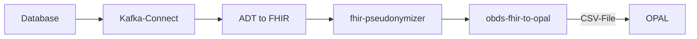

# BZKF Real World Data Platform - Plausibilitätsprüfung

Anwendung zur Durchführung einer Plausibilitätsprüfung anhand der Daten für die BZKF Real World Data Platform.

## Aufbau der ETL-Strecke an den Standorten

Die Daten werden aus der Onkostar-Datenbank ausgelesen und in Apache-Kafka eingespeist.
Nach Durchlauf der ETL-Strecke wird das Ergebnis in einer CSV-Datei gespeichert.
Diese wird dann (aktuell) manuell in OPAL importiert.



## Prüfung der Daten in der CSV-Datei

Vor Veröffentlichung der Daten der CSV-Datei in Opal kann die Anzahl der _Conditions_, gruppiert nach ICD-10 Gruppen,
mit dem Befehl `opal-file` aus der CSV-Datei gewonnen werden.

```
bzkf-rwdp-check opal-file --file <Opal-CSV-Datei>.csv
```

Die Anwendung gibt nun eine Liste der ICD-10-Gruppen mit Anzahl der _Conditions_ aus.

## Prüfung der Daten in der Onkostar-Datenbank

Die Anzahl der _Conditions_, gruppiert nach ICD-10-Gruppe, kann auch mit dem Befehl `database` aus der Onkostar-Datenbank
abgerufen werden.

```
bzkf-rwdp-check database --user me --year 2024
```

Die Anwendung gibt auch hier eine Liste der ICD-10-Gruppen mit Anzahl der _Conditions_ aus.

Dieser Befehl hat noch weitere Parameter:

```
Options:
  -D, --database <DATABASE>  Datenbank-Name [default: onkostar]
  -h, --host <HOST>          Datenbank-Host [default: localhost]
  -P, --port <PORT>          Datenbank-Host [default: 3306]
  -p, --password <PASSWORD>  Passwort. Wenn nicht angegeben, wird danach gefragt
  -u, --user <USER>          Benutzername
  -y, --year <YEAR>          Jahr der Diagnose
```